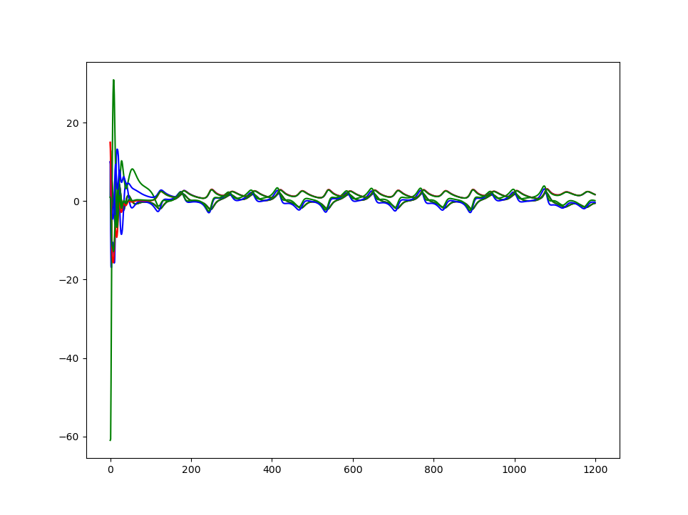

### Fractals and synchronization of chaotic systems

This projects presents some fractals and a synchronization between slave-master chaotic systems to do ciphering


#### Cantor
``` sh
 $ python cantor.py
```


#### Carpet
``` sh
 $ python carpet.py
```


#### Synchronization chaotic systems
``` sh
 $ python synchro2.py
```

slave - master system


coordinate alignment over time

